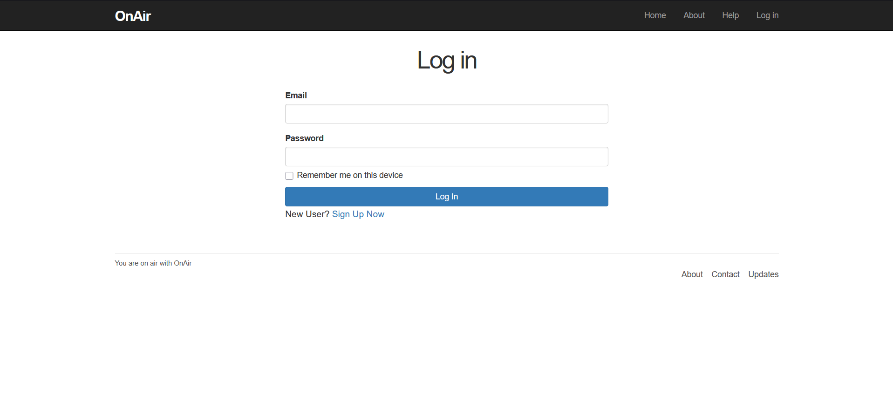
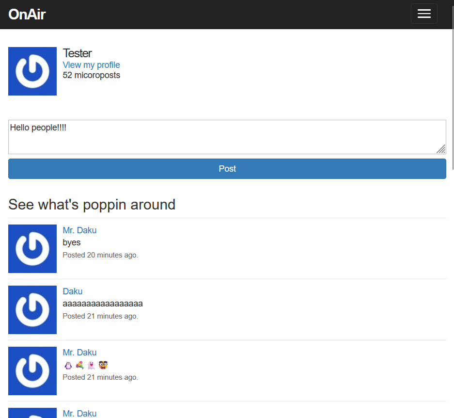

# on_air  - follow the link: http://ec2-18-217-68-105.us-east-2.compute.amazonaws.com:3000/ to check it out  
This is an open source social messaging app, much like Yik Yak, targeting university campuses.  
You can use these credentials to login, or you can **set up your own login** as well:  
**Email: Tester@tester.com  
Password: testPass123**  
  
 
Use the credentials above to login.  
Feel free to play around  

